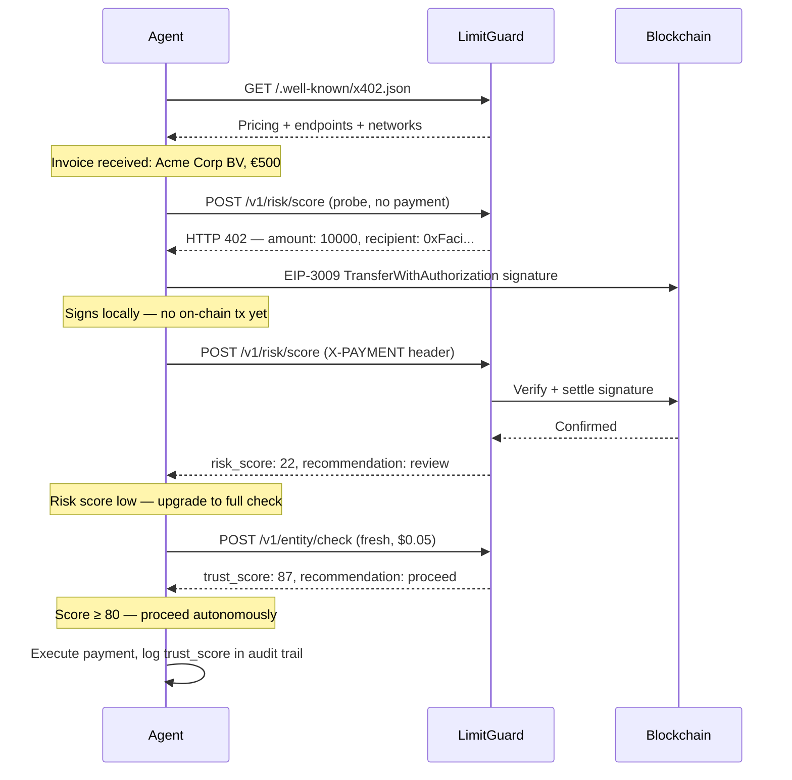

AI agents are now the dominant counterparty in digital commerce. They invoice, pay, onboard vendors, and execute contracts — all without human review. Yet most agents have no mechanism to verify whether the entity on the other side of a transaction is legitimate.

LimitGuard is built for this gap. It exposes trust intelligence through three agent-native protocols — MCP, A2A, and x402 — so any capable agent can discover, pay for, and act on trust scores without human configuration.

<CardGroup cols={3}>
  <Card title="MCP" icon="plug" href="#mcp-model-context-protocol">
    Native tools for Claude, GPT-4, and any LLM that supports the Model Context Protocol
  </Card>
  <Card title="A2A" icon="arrows-left-right" href="#a2a-agent-to-agent">
    Google's Agent-to-Agent protocol — structured capability discovery and invocation
  </Card>
  <Card title="x402" href="#x402-micropayments">
    Pay per call with USDC. No subscription, no API key, no human in the loop
  </Card>
</CardGroup>

<Note>
All discovery endpoints (`/.well-known/*`, `/llms.txt`, `/llms-full.txt`) are **free and unauthenticated**. An agent can discover LimitGuard's full capabilities without a wallet or API key.
</Note>

---

## Why Trust Intelligence Matters for Agents

An autonomous agent executing a payment workflow faces a fundamental asymmetry: it can verify its own instructions perfectly, but it has no ground truth about the entity receiving the payment.

A supplier claiming to be "Acme Corp BV" in Amsterdam could be:
- A legitimate, 12-year-old company with verified KVK registration
- A recently-incorporated shell with no trading history
- An entity on an OFAC or EU sanctions list
- A domain registered last week pointing to a known fraud cluster

Without trust verification, agents must either halt for human review (defeating the purpose of automation) or proceed blind (accepting counterparty risk they cannot quantify).

LimitGuard resolves this in a single API call — returning a 0-100 trust score, a recommendation (`proceed` / `review` / `enhanced_due_diligence` / `block`), and the evidence behind it.

### Agent Decision Framework

| Trust Score | Recommendation | Suggested Agent Behavior |
|-------------|----------------|--------------------------|
| 80-100 | `proceed` | Execute autonomously |
| 60-79 | `review` | Execute with audit log entry |
| 40-59 | `enhanced_due_diligence` | Pause and request human confirmation |
| 0-39 | `block` | Abort transaction, alert operator |

---

## Protocol Overview

| Protocol | Discovery Endpoint | Best For |
|----------|-------------------|----------|
| MCP | `/.well-known/mcp.json` | LLM agents (Claude, GPT-4, Gemini) |
| A2A | `/.well-known/agent.json` | Agent-to-agent workflows (Google ADK, LangGraph) |
| x402 | `/.well-known/x402.json` | Autonomous agents paying per call with USDC |
| llms.txt | `/llms.txt`, `/llms-full.txt` | Context loading for any LLM session |

---

## MCP (Model Context Protocol)

MCP is Anthropic's standard for exposing APIs as native tools to LLM agents. When an LLM is configured with LimitGuard's MCP manifest, it can call trust verification endpoints the same way it calls any built-in tool — no prompt engineering required.

### Discovery

```bash
curl https://api.limitguard.ai/.well-known/mcp.json
```

```json Response
{
  "schema_version": "v1",
  "name_for_human": "LimitGuard Trust Intelligence",
  "name_for_model": "limitguard",
  "description_for_human": "Verify the trustworthiness of any business entity before transacting.",
  "description_for_model": "Use LimitGuard to check entity trust scores before payments, onboarding, or contracts. Returns a 0-100 trust score, risk level, and recommendation (proceed/review/block). Call check_entity_trust for full verification, check_risk_score for fast risk-only, check_kyb for full KYB compliance.",
  "auth": {
    "type": "api_key",
    "header": "X-API-Key"
  },
  "api": {
    "type": "openapi",
    "url": "https://api.limitguard.ai/api-reference/openapi.json"
  },
  "tools": [
    {
      "name": "check_entity_trust",
      "description": "Full trust check against 8 data sources. Returns trust score, cluster, and recommendation.",
      "endpoint": "/v1/entity/check",
      "method": "POST"
    },
    {
      "name": "check_risk_score",
      "description": "Fast risk-only score (2 sources, cheaper). Use for quick pre-screening.",
      "endpoint": "/v1/risk/score",
      "method": "POST"
    },
    {
      "name": "check_kyb",
      "description": "Full Know Your Business compliance check with audit trail.",
      "endpoint": "/v1/kyb/check",
      "method": "POST"
    }
  ]
}
```

### Configuring an LLM Agent

<CodeGroup>

```python Python (Claude SDK)
import anthropic

client = anthropic.Anthropic()

# Register LimitGuard as an MCP server
# Claude will call check_entity_trust automatically when it needs to verify an entity
response = client.beta.messages.create(
    model="claude-opus-4-6",
    max_tokens=1024,
    mcp_servers=[
        {
            "type": "url",
            "url": "https://api.limitguard.ai/mcp",
            "name": "limitguard",
            "authorization_token": "lg_live_xxxxxxxxxxxxxxxxxxxx",
        }
    ],
    messages=[
        {
            "role": "user",
            "content": (
                "I need to pay invoice #INV-2024-447 from Acme Corp BV "
                "(KVK: 12345678, NL). Should I proceed?"
            ),
        }
    ],
    betas=["mcp-client-2025-04-04"],
)

print(response.content)
# Claude calls check_entity_trust internally, interprets the score,
# and returns a recommendation with evidence.
```

```javascript JavaScript (OpenAI SDK)
import OpenAI from "openai";

const client = new OpenAI();

// Define LimitGuard tools from the MCP manifest
const tools = [
  {
    type: "function",
    function: {
      name: "check_entity_trust",
      description:
        "Verify the trustworthiness of a business entity before transacting. " +
        "Returns a 0-100 trust score and recommendation.",
      parameters: {
        type: "object",
        properties: {
          entity_name: { type: "string", description: "Legal business name" },
          country: { type: "string", description: "ISO 3166-1 alpha-2 country code" },
          kvk_number: { type: "string", description: "Dutch KVK registration number (optional)" },
          domain: { type: "string", description: "Company domain (optional)" },
          vat_number: { type: "string", description: "EU VAT number (optional)" },
        },
        required: ["entity_name", "country"],
      },
    },
  },
];

// Tool execution handler
async function executeTool(name, args) {
  if (name === "check_entity_trust") {
    const response = await fetch("https://api.limitguard.ai/v1/entity/check", {
      method: "POST",
      headers: {
        "X-API-Key": process.env.LIMITGUARD_API_KEY,
        "Content-Type": "application/json",
      },
      body: JSON.stringify(args),
    });
    return response.json();
  }
}

// Agentic loop
const messages = [
  {
    role: "user",
    content:
      "Should I pay invoice #INV-2024-447 from Acme Corp BV (KVK: 12345678, NL)?",
  },
];

let response = await client.chat.completions.create({
  model: "gpt-4o",
  messages,
  tools,
});

// Handle tool calls
while (response.choices[0].finish_reason === "tool_calls") {
  const toolCall = response.choices[0].message.tool_calls[0];
  const result = await executeTool(
    toolCall.function.name,
    JSON.parse(toolCall.function.arguments)
  );

  messages.push(response.choices[0].message);
  messages.push({
    role: "tool",
    tool_call_id: toolCall.id,
    content: JSON.stringify(result),
  });

  response = await client.chat.completions.create({
    model: "gpt-4o",
    messages,
    tools,
  });
}

console.log(response.choices[0].message.content);
```

</CodeGroup>

<Tip>
When writing system prompts, instruct the agent explicitly: "Before executing any payment or onboarding a new supplier, always call `check_entity_trust`. Only proceed if `recommendation` is `proceed` or `review`." LLMs follow clear tool-use instructions reliably.
</Tip>

---

## A2A (Agent-to-Agent)

Google's Agent-to-Agent protocol defines a standard for agents to discover and invoke other agents as structured services. LimitGuard publishes an Agent Card that exposes its capabilities, skills, and invocation interface to any A2A-compatible agent.

### Discovery

```bash
curl https://api.limitguard.ai/.well-known/agent.json
```

```json Response
{
  "schema_version": "1.0",
  "name": "LimitGuard Trust Intelligence",
  "description": "Real-time trust scoring for AI agents, businesses, and transactions. 8 data sources. One API call.",
  "url": "https://api.limitguard.ai",
  "version": "1.0.0",
  "capabilities": {
    "streaming": false,
    "pushNotifications": true,
    "stateTransitionHistory": false
  },
  "defaultInputModes": ["application/json"],
  "defaultOutputModes": ["application/json"],
  "skills": [
    {
      "id": "entity_trust_check",
      "name": "Entity Trust Check",
      "description": "Full 8-source trust verification. Returns score, cluster, recommendation, and supporting evidence.",
      "tags": ["trust", "kyb", "compliance", "entity-verification"],
      "examples": [
        "Check trust for Acme Corp BV, NL, KVK 12345678",
        "Is this supplier safe to pay? Domain: acme-corp.nl"
      ],
      "inputModes": ["application/json"],
      "outputModes": ["application/json"]
    },
    {
      "id": "risk_score",
      "name": "Risk Score",
      "description": "Fast risk-only pre-screening (2 sources). Cheaper than full entity check.",
      "tags": ["risk", "screening", "fast"],
      "inputModes": ["application/json"],
      "outputModes": ["application/json"]
    },
    {
      "id": "wallet_screening",
      "name": "Wallet Screening",
      "description": "Crypto wallet risk assessment — ETH, BTC, SOL. Checks for sanctions and known fraud.",
      "tags": ["crypto", "wallet", "sanctions"],
      "inputModes": ["application/json"],
      "outputModes": ["application/json"]
    }
  ],
  "authentication": {
    "schemes": ["ApiKey", "x402"]
  }
}
```

### How an Agent Uses A2A

<CodeGroup>

```python Python (Google ADK)
import httpx

class LimitGuardA2AClient:
    """A2A client for LimitGuard trust verification."""

    AGENT_CARD_URL = "https://api.limitguard.ai/.well-known/agent.json"
    BASE_URL = "https://api.limitguard.ai"

    def __init__(self, api_key: str):
        self.api_key = api_key
        self._card = None

    def discover(self) -> dict:
        """Fetch and cache the agent card."""
        if self._card is None:
            self._card = httpx.get(self.AGENT_CARD_URL).json()
        return self._card

    def get_skill(self, skill_id: str) -> dict | None:
        """Look up a skill by ID from the agent card."""
        card = self.discover()
        return next(
            (s for s in card["skills"] if s["id"] == skill_id),
            None,
        )

    def invoke(self, skill_id: str, payload: dict) -> dict:
        """Invoke a LimitGuard skill via A2A."""
        skill = self.get_skill(skill_id)
        if skill is None:
            raise ValueError(f"Skill '{skill_id}' not found in agent card")

        # Map skill IDs to LimitGuard endpoints
        endpoint_map = {
            "entity_trust_check": "/v1/entity/check",
            "risk_score": "/v1/risk/score",
            "wallet_screening": "/v1/wallet/screen",
        }

        endpoint = endpoint_map.get(skill_id)
        if endpoint is None:
            raise ValueError(f"No endpoint mapped for skill '{skill_id}'")

        response = httpx.post(
            f"{self.BASE_URL}{endpoint}",
            headers={"X-API-Key": self.api_key, "Content-Type": "application/json"},
            json=payload,
            timeout=10.0,
        )
        response.raise_for_status()
        return response.json()


# Usage in an orchestrator agent
client = LimitGuardA2AClient(api_key="lg_live_xxxxxxxxxxxxxxxxxxxx")

# Discover what LimitGuard can do
card = client.discover()
print(f"Available skills: {[s['id'] for s in card['skills']]}")
# Available skills: ['entity_trust_check', 'risk_score', 'wallet_screening']

# Invoke entity trust check
result = client.invoke(
    "entity_trust_check",
    {"entity_name": "Acme Corp BV", "country": "NL", "kvk_number": "12345678"},
)
print(f"Trust score: {result['trust_score']} — {result['recommendation']}")
```

```javascript JavaScript
class LimitGuardA2AClient {
  constructor(apiKey) {
    this.apiKey = apiKey;
    this.baseUrl = "https://api.limitguard.ai";
    this._card = null;
  }

  async discover() {
    if (!this._card) {
      const res = await fetch(`${this.baseUrl}/.well-known/agent.json`);
      this._card = await res.json();
    }
    return this._card;
  }

  async getSkill(skillId) {
    const card = await this.discover();
    return card.skills.find((s) => s.id === skillId) ?? null;
  }

  async invoke(skillId, payload) {
    const skill = await this.getSkill(skillId);
    if (!skill) throw new Error(`Skill '${skillId}' not found in agent card`);

    const endpointMap = {
      entity_trust_check: "/v1/entity/check",
      risk_score: "/v1/risk/score",
      wallet_screening: "/v1/wallet/screen",
    };

    const endpoint = endpointMap[skillId];
    if (!endpoint) throw new Error(`No endpoint mapped for skill '${skillId}'`);

    const res = await fetch(`${this.baseUrl}${endpoint}`, {
      method: "POST",
      headers: {
        "X-API-Key": this.apiKey,
        "Content-Type": "application/json",
      },
      body: JSON.stringify(payload),
    });

    if (!res.ok) throw new Error(`LimitGuard error: ${res.status}`);
    return res.json();
  }
}

// Usage
const client = new LimitGuardA2AClient("lg_live_xxxxxxxxxxxxxxxxxxxx");

const card = await client.discover();
console.log("Skills:", card.skills.map((s) => s.id));

const result = await client.invoke("entity_trust_check", {
  entity_name: "Acme Corp BV",
  country: "NL",
  kvk_number: "12345678",
});
console.log(`Trust score: ${result.trust_score} — ${result.recommendation}`);
```

</CodeGroup>

---

## x402 Micropayments

x402 is the HTTP native payment protocol for AI agents. An agent with a funded USDC wallet can call LimitGuard endpoints **without a subscription or API key** — it discovers pricing, builds a cryptographic payment signature, and includes it in the request header.

This is the fully autonomous path: no human creates an account, no API key is provisioned, no billing is configured.

### Discovery

```bash
curl https://api.limitguard.ai/.well-known/x402.json
```

```json Response
{
  "name": "LimitGuard Trust Intelligence API",
  "description": "Entity verification and risk scoring for EU businesses",
  "version": "2",
  "endpoints": [
    {
      "path": "/v1/entity/check",
      "method": "POST",
      "price_usdc": "0.05",
      "chain": "eip155:8453",
      "currency": "USDC",
      "quality_tiers": {
        "cached": "0.01",
        "fresh": "0.05",
        "enhanced": "0.15"
      }
    },
    {
      "path": "/v1/risk/score",
      "method": "POST",
      "price_usdc": "0.01",
      "chain": "eip155:8453",
      "currency": "USDC"
    },
    {
      "path": "/v1/kyb/check",
      "method": "POST",
      "price_usdc": "1.25",
      "chain": "eip155:8453",
      "currency": "USDC"
    }
  ],
  "payment_methods": [
    {"type": "x402", "version": "2"},
    {"type": "api_key"}
  ],
  "networks": ["eip155:8453", "eip155:84532", "solana:5eykt4UsFv8P8NJdTREpY1vzqKqZKvdp"]
}
```

### How x402 Works

<Steps>
  <Step title="Probe the endpoint (optional)">
    Make a request without payment. The server returns HTTP 402 with the exact payment requirements for this call. You can skip this step if you already read requirements from `/.well-known/x402.json`.
  </Step>
  <Step title="Build the payment signature">
    Construct an EIP-3009 `TransferWithAuthorization` signature authorizing the USDC transfer. Sign it with your agent's wallet private key.
  </Step>
  <Step title="Base64-encode the payment object">
    Serialize the payment payload to JSON and base64-encode it. This becomes the `X-PAYMENT` header value.
  </Step>
  <Step title="Retry the request with X-PAYMENT">
    Send the original request again, including the `X-PAYMENT` header. LimitGuard verifies the signature on-chain, executes the transfer, and returns the trust score.
  </Step>
  <Step title="Check response headers">
    Confirm `X-Payment-Verified: true`. If you see `X-Payment-Fallback: true`, the circuit breaker triggered a cached-wallet path (rare).
  </Step>
</Steps>

### Full x402 Implementation

<CodeGroup>

```python Python
import base64
import json
import secrets
import time
import httpx
from eth_account import Account
from eth_account.messages import encode_typed_data

USDC_BASE = "0x833589fCD6eDb6E08f4c7C32D4f71b54bdA02913"
CHAIN_ID = "eip155:8453"

def build_x402_payment(
    amount_usdc: int,    # in 6-decimal units (50000 = $0.05)
    sender_key: str,     # agent wallet private key
    recipient: str,      # facilitator address from 402 response
) -> str:
    sender = Account.from_key(sender_key).address
    chain_num = int(CHAIN_ID.split(":")[1])  # 8453
    nonce = "0x" + secrets.token_hex(32)
    now = int(time.time())

    domain = {
        "name": "USD Coin",
        "version": "2",
        "chainId": chain_num,
        "verifyingContract": USDC_BASE,
    }
    types = {
        "EIP712Domain": [
            {"name": "name", "type": "string"},
            {"name": "version", "type": "string"},
            {"name": "chainId", "type": "uint256"},
            {"name": "verifyingContract", "type": "address"},
        ],
        "TransferWithAuthorization": [
            {"name": "from", "type": "address"},
            {"name": "to", "type": "address"},
            {"name": "value", "type": "uint256"},
            {"name": "validAfter", "type": "uint256"},
            {"name": "validBefore", "type": "uint256"},
            {"name": "nonce", "type": "bytes32"},
        ],
    }
    message = {
        "from": sender,
        "to": recipient,
        "value": amount_usdc,
        "validAfter": now - 10,
        "validBefore": now + 300,
        "nonce": bytes.fromhex(nonce[2:]),
    }

    signable = encode_typed_data(domain, types, "TransferWithAuthorization", message)
    signed = Account.sign_message(signable, private_key=sender_key)

    payload = {
        "chainId": CHAIN_ID,
        "amount": str(amount_usdc),
        "sender": sender,
        "recipient": recipient,
        "nonce": nonce,
        "signature": signed.signature.hex(),
        "validAfter": now - 10,
        "validBefore": now + 300,
    }
    return base64.b64encode(json.dumps(payload).encode()).decode()


def verify_entity_x402(
    entity_name: str,
    country: str,
    sender_key: str,
    quality: str = "fresh",  # cached | fresh | enhanced
) -> dict:
    tier_prices = {"cached": 10_000, "fresh": 50_000, "enhanced": 150_000}
    amount = tier_prices[quality]

    # Step 1: Probe to get facilitator address
    probe = httpx.post(
        "https://api.limitguard.ai/v1/entity/check",
        headers={"X-Response-Quality": quality, "Content-Type": "application/json"},
        json={"entity_name": entity_name, "country": country},
    )
    assert probe.status_code == 402, f"Expected 402, got {probe.status_code}"
    facilitator = probe.json()["accepts"][0]["recipient"]

    # Step 2: Build payment and call
    x_payment = build_x402_payment(amount, sender_key, facilitator)

    response = httpx.post(
        "https://api.limitguard.ai/v1/entity/check",
        headers={
            "X-PAYMENT": x_payment,
            "X-Response-Quality": quality,
            "Content-Type": "application/json",
        },
        json={"entity_name": entity_name, "country": country},
        timeout=15.0,
    )
    response.raise_for_status()
    return response.json()


# Usage
result = verify_entity_x402(
    entity_name="Acme Corp BV",
    country="NL",
    sender_key="0xYOUR_AGENT_WALLET_PRIVATE_KEY",
    quality="fresh",
)
print(f"Trust score: {result['trust_score']} — {result['recommendation']}")
```

```javascript JavaScript
import { ethers } from "ethers";

const USDC_BASE = "0x833589fCD6eDb6E08f4c7C32D4f71b54bdA02913";
const CHAIN_ID = "eip155:8453";

async function buildX402Payment(amountUsdc, signer, recipient) {
  const chainNum = parseInt(CHAIN_ID.split(":")[1]);
  const nonce =
    "0x" +
    [...crypto.getRandomValues(new Uint8Array(32))]
      .map((b) => b.toString(16).padStart(2, "0"))
      .join("");
  const now = Math.floor(Date.now() / 1000);

  const domain = {
    name: "USD Coin",
    version: "2",
    chainId: chainNum,
    verifyingContract: USDC_BASE,
  };
  const types = {
    TransferWithAuthorization: [
      { name: "from", type: "address" },
      { name: "to", type: "address" },
      { name: "value", type: "uint256" },
      { name: "validAfter", type: "uint256" },
      { name: "validBefore", type: "uint256" },
      { name: "nonce", type: "bytes32" },
    ],
  };
  const message = {
    from: signer.address,
    to: recipient,
    value: amountUsdc,
    validAfter: now - 10,
    validBefore: now + 300,
    nonce,
  };

  const signature = await signer.signTypedData(domain, types, message);

  return btoa(
    JSON.stringify({
      chainId: CHAIN_ID,
      amount: String(amountUsdc),
      sender: signer.address,
      recipient,
      nonce,
      signature,
      validAfter: now - 10,
      validBefore: now + 300,
    })
  );
}

async function verifyEntityX402(entityName, country, signer, quality = "fresh") {
  const tierPrices = { cached: 10_000, fresh: 50_000, enhanced: 150_000 };
  const amount = tierPrices[quality];

  // Step 1: Probe to get facilitator address
  const probe = await fetch("https://api.limitguard.ai/v1/entity/check", {
    method: "POST",
    headers: {
      "X-Response-Quality": quality,
      "Content-Type": "application/json",
    },
    body: JSON.stringify({ entity_name: entityName, country }),
  });

  if (probe.status !== 402) throw new Error(`Expected 402, got ${probe.status}`);
  const { accepts } = await probe.json();
  const facilitator = accepts[0].recipient;

  // Step 2: Build payment and call
  const xPayment = await buildX402Payment(amount, signer, facilitator);

  const response = await fetch("https://api.limitguard.ai/v1/entity/check", {
    method: "POST",
    headers: {
      "X-PAYMENT": xPayment,
      "X-Response-Quality": quality,
      "Content-Type": "application/json",
    },
    body: JSON.stringify({ entity_name: entityName, country }),
  });

  if (!response.ok) throw new Error(`LimitGuard error: ${response.status}`);
  return response.json();
}

// Usage
const provider = new ethers.JsonRpcProvider("https://mainnet.base.org");
const signer = new ethers.Wallet(process.env.AGENT_PRIVATE_KEY, provider);

const result = await verifyEntityX402("Acme Corp BV", "NL", signer, "fresh");
console.log(`Trust score: ${result.trust_score} — ${result.recommendation}`);
```

</CodeGroup>

### Quality Tiers

Control cost vs. freshness with the `X-Response-Quality` header. The payment amount must match or exceed the tier price.

| Tier | Header Value | /v1/entity/check | /v1/risk/score | /v1/kyb/check | Data Freshness |
|------|-------------|-----------------|----------------|---------------|----------------|
| Cached | `cached` | $0.01 (10,000) | $0.005 (5,000) | $0.25 (250,000) | Up to 24h cached |
| Fresh | `fresh` | $0.05 (50,000) | $0.01 (10,000) | $1.25 (1,250,000) | Live fan-out (default) |
| Enhanced | `enhanced` | $0.15 (150,000) | $0.05 (50,000) | $2.50 (2,500,000) | Live + premium sources |

<Tip>
For high-frequency screening (e.g., checking every inbound invoice), start with `cached` for pre-screening and only upgrade to `fresh` when the cached score is below 70. This reduces cost by 5x on clean counterparties.
</Tip>

---

## End-to-End Agent Example

This example shows a complete autonomous payment agent — from cold start to decision — using discovery, x402 payment, and trust-gated execution.



### Complete Implementation

<CodeGroup>

```python Python
import base64
import json
import os
import secrets
import time
from dataclasses import dataclass
from enum import Enum

import httpx
from eth_account import Account
from eth_account.messages import encode_typed_data


class TrustDecision(Enum):
    PROCEED = "proceed"
    REVIEW = "review"
    ENHANCED_DUE_DILIGENCE = "enhanced_due_diligence"
    BLOCK = "block"


@dataclass
class TrustResult:
    score: int
    level: str
    decision: TrustDecision
    cluster: str
    sources_checked: list[str]
    processing_ms: int
    paid_usdc: float


class TrustGatedAgent:
    """
    An autonomous payment agent that verifies counterparty trust
    before executing transactions — no human in the loop.
    """

    DISCOVERY_URL = "https://api.limitguard.ai/.well-known/x402.json"
    BASE_URL = "https://api.limitguard.ai"
    USDC_BASE = "0x833589fCD6eDb6E08f4c7C32D4f71b54bdA02913"
    CHAIN_ID = "eip155:8453"

    def __init__(self, wallet_private_key: str):
        self.wallet = Account.from_key(wallet_private_key)
        self._discovery_cache: dict | None = None

    # ------------------------------------------------------------------ #
    # Discovery                                                            #
    # ------------------------------------------------------------------ #

    def discover(self) -> dict:
        """Fetch and cache the x402 service listing."""
        if self._discovery_cache is None:
            response = httpx.get(self.DISCOVERY_URL, timeout=5.0)
            response.raise_for_status()
            self._discovery_cache = response.json()
        return self._discovery_cache

    def get_price(self, endpoint: str, quality: str = "fresh") -> int:
        """Return price in USDC 6-decimal units for an endpoint + quality tier."""
        listing = self.discover()
        entry = next(
            (e for e in listing["endpoints"] if e["path"] == endpoint), None
        )
        if entry is None:
            raise ValueError(f"Endpoint {endpoint} not in discovery listing")
        tiers = entry.get("quality_tiers", {})
        price_str = tiers.get(quality) or entry.get("price_usdc", "0.05")
        return int(float(price_str) * 1_000_000)

    # ------------------------------------------------------------------ #
    # Payment                                                              #
    # ------------------------------------------------------------------ #

    def _get_facilitator(self, endpoint: str, payload: dict) -> str:
        """Probe an endpoint to get the current facilitator address."""
        probe = httpx.post(
            f"{self.BASE_URL}{endpoint}",
            headers={"Content-Type": "application/json"},
            json=payload,
            timeout=10.0,
        )
        if probe.status_code != 402:
            raise RuntimeError(f"Expected 402 probe, got {probe.status_code}")
        accepts = probe.json()["accepts"]
        # Prefer Base chain
        for option in accepts:
            if option["chainId"] == self.CHAIN_ID:
                return option["recipient"]
        return accepts[0]["recipient"]

    def _build_payment(self, amount: int, recipient: str) -> str:
        """Build an EIP-3009 x402 payment header."""
        chain_num = int(self.CHAIN_ID.split(":")[1])
        nonce = "0x" + secrets.token_hex(32)
        now = int(time.time())

        domain = {
            "name": "USD Coin",
            "version": "2",
            "chainId": chain_num,
            "verifyingContract": self.USDC_BASE,
        }
        types = {
            "EIP712Domain": [
                {"name": "name", "type": "string"},
                {"name": "version", "type": "string"},
                {"name": "chainId", "type": "uint256"},
                {"name": "verifyingContract", "type": "address"},
            ],
            "TransferWithAuthorization": [
                {"name": "from", "type": "address"},
                {"name": "to", "type": "address"},
                {"name": "value", "type": "uint256"},
                {"name": "validAfter", "type": "uint256"},
                {"name": "validBefore", "type": "uint256"},
                {"name": "nonce", "type": "bytes32"},
            ],
        }
        message = {
            "from": self.wallet.address,
            "to": recipient,
            "value": amount,
            "validAfter": now - 10,
            "validBefore": now + 300,
            "nonce": bytes.fromhex(nonce[2:]),
        }

        signable = encode_typed_data(
            domain, types, "TransferWithAuthorization", message
        )
        signed = Account.sign_message(signable, private_key=self.wallet.key)

        payload = {
            "chainId": self.CHAIN_ID,
            "amount": str(amount),
            "sender": self.wallet.address,
            "recipient": recipient,
            "nonce": nonce,
            "signature": signed.signature.hex(),
            "validAfter": now - 10,
            "validBefore": now + 300,
        }
        return base64.b64encode(json.dumps(payload).encode()).decode()

    def _call(self, endpoint: str, payload: dict, quality: str) -> dict:
        """Make a paid API call."""
        amount = self.get_price(endpoint, quality)
        facilitator = self._get_facilitator(endpoint, payload)
        x_payment = self._build_payment(amount, facilitator)

        response = httpx.post(
            f"{self.BASE_URL}{endpoint}",
            headers={
                "X-PAYMENT": x_payment,
                "X-Response-Quality": quality,
                "Content-Type": "application/json",
            },
            json=payload,
            timeout=15.0,
        )
        response.raise_for_status()
        return response.json()

    # ------------------------------------------------------------------ #
    # Trust verification logic                                             #
    # ------------------------------------------------------------------ #

    def _score_to_decision(self, score: int) -> TrustDecision:
        if score >= 80:
            return TrustDecision.PROCEED
        elif score >= 60:
            return TrustDecision.REVIEW
        elif score >= 40:
            return TrustDecision.ENHANCED_DUE_DILIGENCE
        else:
            return TrustDecision.BLOCK

    def verify(self, entity_name: str, country: str, **kwargs) -> TrustResult:
        """
        Verify an entity using a two-pass strategy:
        1. Cheap risk score pre-screen
        2. Full entity check only if pre-screen passes
        """
        payload = {"entity_name": entity_name, "country": country, **kwargs}
        total_paid = 0.0

        # Pass 1: Fast pre-screen ($0.01)
        risk_data = self._call("/v1/risk/score", payload, quality="cached")
        total_paid += 0.01
        pre_score = risk_data.get("risk_score", 50)

        if pre_score > 80:
            # High risk — block immediately without paying for full check
            return TrustResult(
                score=100 - pre_score,
                level="high_risk",
                decision=TrustDecision.BLOCK,
                cluster="unknown",
                sources_checked=risk_data.get("sources_checked", []),
                processing_ms=risk_data.get("processing_time_ms", 0),
                paid_usdc=total_paid,
            )

        # Pass 2: Full entity check ($0.05 fresh)
        trust_data = self._call("/v1/entity/check", payload, quality="fresh")
        total_paid += 0.05

        trust_score = trust_data["trust_score"]
        decision = self._score_to_decision(trust_score)

        return TrustResult(
            score=trust_score,
            level=trust_data["trust_level"],
            decision=decision,
            cluster=trust_data.get("cluster", "unknown"),
            sources_checked=trust_data.get("sources_checked", []),
            processing_ms=trust_data.get("processing_time_ms", 0),
            paid_usdc=total_paid,
        )

    def should_pay_invoice(
        self,
        invoice_id: str,
        supplier_name: str,
        country: str,
        amount_eur: float,
        **entity_kwargs,
    ) -> tuple[bool, TrustResult]:
        """
        Top-level decision: should this invoice be paid autonomously?
        Returns (approved, trust_result).
        """
        result = self.verify(supplier_name, country, **entity_kwargs)

        approved = result.decision in (TrustDecision.PROCEED, TrustDecision.REVIEW)

        print(
            f"Invoice {invoice_id} | Supplier: {supplier_name} | "
            f"Amount: €{amount_eur:.2f} | "
            f"Trust: {result.score}/100 ({result.decision.value}) | "
            f"Cost: ${result.paid_usdc:.3f} USDC"
        )

        return approved, result


# ------------------------------------------------------------------ #
# Usage                                                                #
# ------------------------------------------------------------------ #

agent = TrustGatedAgent(wallet_private_key=os.environ["AGENT_WALLET_KEY"])

approved, trust = agent.should_pay_invoice(
    invoice_id="INV-2024-447",
    supplier_name="Acme Corp BV",
    country="NL",
    amount_eur=500.00,
    kvk_number="12345678",
    domain="acme-corp.nl",
)

if approved:
    print(f"Proceeding with payment. Cluster: {trust.cluster}")
    # execute_payment(...)
else:
    print(f"Payment blocked. Score: {trust.score}. Alerting operator.")
    # alert_operator(...)
```

```javascript JavaScript
import { ethers } from "ethers";

const USDC_BASE = "0x833589fCD6eDb6E08f4c7C32D4f71b54bdA02913";
const CHAIN_ID = "eip155:8453";
const BASE_URL = "https://api.limitguard.ai";

const TrustDecision = {
  PROCEED: "proceed",
  REVIEW: "review",
  ENHANCED_DUE_DILIGENCE: "enhanced_due_diligence",
  BLOCK: "block",
};

const TIER_PRICES = { cached: 10_000, fresh: 50_000, enhanced: 150_000 };

class TrustGatedAgent {
  constructor(privateKey) {
    const provider = new ethers.JsonRpcProvider("https://mainnet.base.org");
    this.signer = new ethers.Wallet(privateKey, provider);
    this._discoveryCache = null;
  }

  async discover() {
    if (!this._discoveryCache) {
      const res = await fetch(`${BASE_URL}/.well-known/x402.json`);
      this._discoveryCache = await res.json();
    }
    return this._discoveryCache;
  }

  async getPrice(endpoint, quality = "fresh") {
    const listing = await this.discover();
    const entry = listing.endpoints.find((e) => e.path === endpoint);
    if (!entry) throw new Error(`Endpoint ${endpoint} not in discovery listing`);
    const price = entry.quality_tiers?.[quality] ?? entry.price_usdc ?? "0.05";
    return Math.round(parseFloat(price) * 1_000_000);
  }

  async getFacilitator(endpoint, payload) {
    const probe = await fetch(`${BASE_URL}${endpoint}`, {
      method: "POST",
      headers: { "Content-Type": "application/json" },
      body: JSON.stringify(payload),
    });
    if (probe.status !== 402) throw new Error(`Expected 402, got ${probe.status}`);
    const { accepts } = await probe.json();
    const base = accepts.find((a) => a.chainId === CHAIN_ID);
    return (base ?? accepts[0]).recipient;
  }

  async buildPayment(amount, recipient) {
    const chainNum = parseInt(CHAIN_ID.split(":")[1]);
    const nonce =
      "0x" +
      [...crypto.getRandomValues(new Uint8Array(32))]
        .map((b) => b.toString(16).padStart(2, "0"))
        .join("");
    const now = Math.floor(Date.now() / 1000);

    const domain = {
      name: "USD Coin",
      version: "2",
      chainId: chainNum,
      verifyingContract: USDC_BASE,
    };
    const types = {
      TransferWithAuthorization: [
        { name: "from", type: "address" },
        { name: "to", type: "address" },
        { name: "value", type: "uint256" },
        { name: "validAfter", type: "uint256" },
        { name: "validBefore", type: "uint256" },
        { name: "nonce", type: "bytes32" },
      ],
    };
    const message = {
      from: this.signer.address,
      to: recipient,
      value: amount,
      validAfter: now - 10,
      validBefore: now + 300,
      nonce,
    };

    const signature = await this.signer.signTypedData(domain, types, message);

    return btoa(
      JSON.stringify({
        chainId: CHAIN_ID,
        amount: String(amount),
        sender: this.signer.address,
        recipient,
        nonce,
        signature,
        validAfter: now - 10,
        validBefore: now + 300,
      })
    );
  }

  async call(endpoint, payload, quality) {
    const amount = await this.getPrice(endpoint, quality);
    const facilitator = await this.getFacilitator(endpoint, payload);
    const xPayment = await this.buildPayment(amount, facilitator);

    const res = await fetch(`${BASE_URL}${endpoint}`, {
      method: "POST",
      headers: {
        "X-PAYMENT": xPayment,
        "X-Response-Quality": quality,
        "Content-Type": "application/json",
      },
      body: JSON.stringify(payload),
    });
    if (!res.ok) throw new Error(`LimitGuard error: ${res.status}`);
    return res.json();
  }

  scoreToDecision(score) {
    if (score >= 80) return TrustDecision.PROCEED;
    if (score >= 60) return TrustDecision.REVIEW;
    if (score >= 40) return TrustDecision.ENHANCED_DUE_DILIGENCE;
    return TrustDecision.BLOCK;
  }

  async verify(entityName, country, extras = {}) {
    const payload = { entity_name: entityName, country, ...extras };
    let totalPaid = 0;

    // Pass 1: Fast pre-screen
    const riskData = await this.call("/v1/risk/score", payload, "cached");
    totalPaid += 0.01;
    const preScore = riskData.risk_score ?? 50;

    if (preScore > 80) {
      return {
        score: 100 - preScore,
        level: "high_risk",
        decision: TrustDecision.BLOCK,
        cluster: "unknown",
        paidUsdc: totalPaid,
      };
    }

    // Pass 2: Full entity check
    const trustData = await this.call("/v1/entity/check", payload, "fresh");
    totalPaid += 0.05;

    return {
      score: trustData.trust_score,
      level: trustData.trust_level,
      decision: this.scoreToDecision(trustData.trust_score),
      cluster: trustData.cluster ?? "unknown",
      sourcesChecked: trustData.sources_checked ?? [],
      processingMs: trustData.processing_time_ms ?? 0,
      paidUsdc: totalPaid,
    };
  }

  async shouldPayInvoice(invoiceId, supplierName, country, amountEur, extras = {}) {
    const result = await this.verify(supplierName, country, extras);
    const approved = [TrustDecision.PROCEED, TrustDecision.REVIEW].includes(
      result.decision
    );

    console.log(
      `Invoice ${invoiceId} | ${supplierName} | €${amountEur} | ` +
        `Trust: ${result.score}/100 (${result.decision}) | ` +
        `Cost: $${result.paidUsdc.toFixed(3)} USDC`
    );

    return { approved, result };
  }
}

// Usage
const agent = new TrustGatedAgent(process.env.AGENT_WALLET_KEY);

const { approved, result } = await agent.shouldPayInvoice(
  "INV-2024-447",
  "Acme Corp BV",
  "NL",
  500.0,
  { kvk_number: "12345678", domain: "acme-corp.nl" }
);

if (approved) {
  console.log(`Proceeding. Cluster: ${result.cluster}`);
} else {
  console.log(`Blocked. Score: ${result.score}. Alerting operator.`);
}
```

</CodeGroup>

---

## llms.txt — LLM Context Loading

LimitGuard implements the [llms.txt standard](https://llmstxt.org/) — machine-readable files that let any LLM load a structured API summary into its context window.

### Endpoints

| File | Size | Use |
|------|------|-----|
| `/llms.txt` | ~2KB | Quick context loading — overview + key endpoints |
| `/llms-full.txt` | ~20KB | Complete reference — all endpoints, pricing, examples |

```bash
# Load into a Claude session
curl https://api.limitguard.ai/llms.txt

# Load full reference for agent coding tasks
curl https://api.limitguard.ai/llms-full.txt
```

### When to Use llms.txt

<CodeGroup>

```python Python
import httpx

def load_limitguard_context(full: bool = False) -> str:
    """Load LimitGuard API context for injection into an LLM prompt."""
    url = "https://api.limitguard.ai/llms-full.txt" if full else "https://api.limitguard.ai/llms.txt"
    response = httpx.get(url, timeout=5.0)
    response.raise_for_status()
    return response.text


# Inject into a system prompt for a coding assistant
context = load_limitguard_context(full=True)

system_prompt = f"""You are a payment automation assistant.
You have access to the LimitGuard Trust Intelligence API.

{context}

Before authorizing any payment, call the entity check endpoint.
Block all transactions where recommendation is 'block'.
"""
```

```javascript JavaScript
async function loadLimitGuardContext(full = false) {
  const url = full
    ? "https://api.limitguard.ai/llms-full.txt"
    : "https://api.limitguard.ai/llms.txt";
  const res = await fetch(url);
  return res.text();
}

// Inject into a system prompt
const context = await loadLimitGuardContext(true);

const systemPrompt = `You are a payment automation assistant.
You have access to the LimitGuard Trust Intelligence API.

${context}

Before authorizing any payment, call the entity check endpoint.
Block all transactions where recommendation is 'block'.`;
```

</CodeGroup>

<Tip>
Use `/llms.txt` (concise) for general-purpose agents where token budget matters. Use `/llms-full.txt` when the agent needs to generate code that calls LimitGuard — the full reference includes request/response schemas and error codes.
</Tip>

---

## Cross-Sell Recommendations

Agents calling one endpoint can discover complementary services at runtime:

```bash
curl "https://api.limitguard.ai/v1/sales/recommendations?current_endpoint=/v1/risk/score&trust_score=45"
```

```json Response
{
  "recommendations": [
    {
      "endpoint": "/v1/entity/check",
      "reason": "Risk score 45 is borderline — full entity check provides 6 more data sources for higher confidence",
      "estimated_uplift": "30-40% more signal"
    },
    {
      "endpoint": "/v1/compliance/readiness/{entity_id}",
      "reason": "Low-medium scores often reveal compliance gaps worth investigating before onboarding"
    }
  ]
}
```

Agents can use this to self-direct their verification strategy without hardcoded decision trees.

---

## Sandbox Mode for Agent Development

Build and test your agent integration without spending USDC or calling real data sources.

### Activating Sandbox for Agents

Two approaches depending on your agent's authentication method:

<CodeGroup>

```python Python (Header — any auth method)
import httpx

def verify_entity_sandbox(entity_name: str, country: str, api_key: str) -> dict:
    """Sandbox mode — deterministic mock data, no payment, no quota."""
    response = httpx.post(
        "https://api.limitguard.ai/v1/entity/check",
        headers={
            "X-API-Key": api_key,
            "X-LimitGuard-Mode": "sandbox",
            "Content-Type": "application/json",
        },
        json={"entity_name": entity_name, "country": country},
        timeout=5.0,
    )
    response.raise_for_status()
    return response.json()

# Sandbox response is deterministic — useful for unit tests
result = verify_entity_sandbox("Any Company", "NL", api_key="lg_live_xxxxxxxxxxxxxxxxxxxx")
# Always returns: trust_score: 75, recommendation: "review"
```

```python Python (Test key — automatic sandbox)
import httpx

# lg_test_ keys automatically activate sandbox for all requests
# No header needed — useful for CI/CD where you don't want accidental live calls
def verify_entity(entity_name: str, country: str) -> dict:
    response = httpx.post(
        "https://api.limitguard.ai/v1/entity/check",
        headers={"X-API-Key": "lg_test_xxxxxxxxxxxxxxxxxxxx"},
        json={"entity_name": entity_name, "country": country},
    )
    response.raise_for_status()
    return response.json()
```

```javascript JavaScript
// Sandbox via environment variable toggle
const isSandbox = process.env.NODE_ENV !== "production";

async function verifyEntity(entityName, country) {
  const headers = {
    "X-API-Key": process.env.LIMITGUARD_API_KEY,
    "Content-Type": "application/json",
  };

  if (isSandbox) {
    headers["X-LimitGuard-Mode"] = "sandbox";
  }

  const res = await fetch("https://api.limitguard.ai/v1/entity/check", {
    method: "POST",
    headers,
    body: JSON.stringify({ entity_name: entityName, country }),
  });

  return res.json();
}
```

</CodeGroup>

### Sandbox Behavior Reference

| Property | Sandbox | Production |
|----------|---------|------------|
| Data sources | Mock only — no real KVK, sanctions, VIES | All 8 sources, live |
| Responses | Deterministic (same input = same output) | Live results |
| x402 payment | Skipped entirely | Required (or API key) |
| Quota | Not consumed | Consumed |
| Rate limit | 10 req/min per IP | Tier-based |
| Response time | ~5ms | ~250-500ms |

### Writing Agent Tests with Sandbox

```python
import pytest
import httpx

API_KEY = "lg_test_xxxxxxxxxxxxxxxxxxxx"  # lg_test_ auto-activates sandbox


@pytest.mark.asyncio
async def test_agent_blocks_on_high_risk():
    """Agent should block payment when trust score is below threshold."""
    # Sandbox always returns trust_score: 75 — test the routing logic
    response = httpx.post(
        "https://api.limitguard.ai/v1/entity/check",
        headers={"X-API-Key": API_KEY},
        json={"entity_name": "Test Corp", "country": "NL"},
    )
    assert response.status_code == 200
    data = response.json()

    # Verify response schema
    assert "trust_score" in data
    assert "recommendation" in data
    assert isinstance(data["trust_score"], int)
    assert 0 <= data["trust_score"] <= 100

    # Test agent decision logic
    decision = score_to_decision(data["trust_score"])
    assert decision in ("proceed", "review", "enhanced_due_diligence", "block")


@pytest.mark.asyncio
async def test_discovery_returns_pricing():
    """Agent should be able to read pricing from discovery endpoint."""
    response = httpx.get("https://api.limitguard.ai/.well-known/x402.json")
    assert response.status_code == 200
    listing = response.json()

    entity_check = next(
        (e for e in listing["endpoints"] if e["path"] == "/v1/entity/check"),
        None,
    )
    assert entity_check is not None
    assert float(entity_check["price_usdc"]) > 0
```

---

## Best Practices

### 1. Cache Discovery Responses

Discovery endpoints don't change between deploys. Cache them aggressively.

```python
from functools import lru_cache
import httpx

@lru_cache(maxsize=1)
def get_discovery() -> dict:
    """Cache the x402 discovery listing for the lifetime of the process."""
    return httpx.get("https://api.limitguard.ai/.well-known/x402.json").json()
```

<Note>
Discovery endpoints have a `Cache-Control: max-age=3600` header. Respect it — refreshing more frequently adds latency with no benefit.
</Note>

### 2. Handle HTTP 402 Gracefully

A well-built agent treats 402 as a normal flow, not an error.

```python
import httpx

def call_with_payment_fallback(
    endpoint: str,
    payload: dict,
    build_payment_fn,
) -> dict:
    # Attempt 1: without payment (returns 402 with requirements)
    probe = httpx.post(endpoint, json=payload)

    if probe.status_code == 402:
        # Normal flow — extract requirements and retry with payment
        requirements = probe.json()
        x_payment = build_payment_fn(requirements)
        response = httpx.post(
            endpoint,
            headers={"X-PAYMENT": x_payment},
            json=payload,
        )
        response.raise_for_status()
        return response.json()

    elif probe.status_code == 200:
        # Unexpected free response (e.g., cached hit or sandbox)
        return probe.json()

    else:
        probe.raise_for_status()
```

### 3. Use Quality Tiers Strategically

Don't pay for `fresh` when `cached` is sufficient.

| Scenario | Recommended Tier | Reason |
|----------|-----------------|--------|
| First-time supplier onboarding | `enhanced` | High stakes, need maximum signal |
| Repeat invoice from known supplier | `cached` | Already verified, use cached result |
| Pre-screening inbound leads | `cached` | Volume operation, cost matters |
| Transaction >$10,000 | `fresh` | High value, needs live data |
| Compliance audit trigger | `enhanced` | Full evidence trail required |

### 4. Log Trust Scores in Your Audit Trail

For regulated workflows, store the trust score alongside the transaction:

```python
import datetime

def execute_payment_with_audit(
    invoice_id: str,
    supplier: str,
    amount: float,
    trust_result: TrustResult,
) -> None:
    audit_entry = {
        "invoice_id": invoice_id,
        "supplier": supplier,
        "amount": amount,
        "timestamp": datetime.datetime.utcnow().isoformat(),
        "trust_score": trust_result.score,
        "trust_level": trust_result.level,
        "trust_decision": trust_result.decision.value,
        "trust_cluster": trust_result.cluster,
        "sources_checked": trust_result.sources_checked,
        "verification_cost_usdc": trust_result.paid_usdc,
    }
    # Store to your audit database
    db.insert("payment_audit_log", audit_entry)
```

### 5. Set Nonce Expiry Windows Conservatively

x402 nonces expire 5 minutes after `validBefore`. Set a 5-minute window (`validBefore = now + 300`) — tight enough to prevent replay attacks, wide enough to survive network retries.

### 6. Never Hardcode Facilitator Addresses

The facilitator address is returned dynamically in each 402 response. Always read it from the response — never hardcode it. The address can change during upgrades.

---

## Protocol Comparison

| | MCP | A2A | x402 |
|--|-----|-----|------|
| **Best for** | LLM agents (Claude, GPT) | Multi-agent workflows | Fully autonomous agents |
| **Authentication** | API key via manifest config | API key or x402 | USDC wallet (no account) |
| **Discovery** | `/.well-known/mcp.json` | `/.well-known/agent.json` | `/.well-known/x402.json` |
| **Human setup required** | Minimal (configure MCP server) | Minimal (discover card) | None |
| **Cost model** | Subscription or quota | Subscription or quota | Pay-per-call USDC |
| **Capability negotiation** | Tool definitions | Skill catalog | Endpoint + pricing listing |
| **Production maturity** | GA | Beta | GA |

---

## Next Steps

<CardGroup cols={2}>
  <Card title="x402 Protocol" icon="credit-card" href="/x402-protocol">
    Full x402 implementation guide with EVM and Solana examples
  </Card>
  <Card title="Discovery" icon="satellite-dish" href="/discovery">
    All machine-readable discovery endpoints
  </Card>
  <Card title="Sandbox" icon="flask" href="/sandbox">
    Test your agent integration for free
  </Card>
  <Card title="API Reference" icon="code" href="/api-reference/introduction">
    Interactive playground for all 64 endpoints
  </Card>
</CardGroup>
