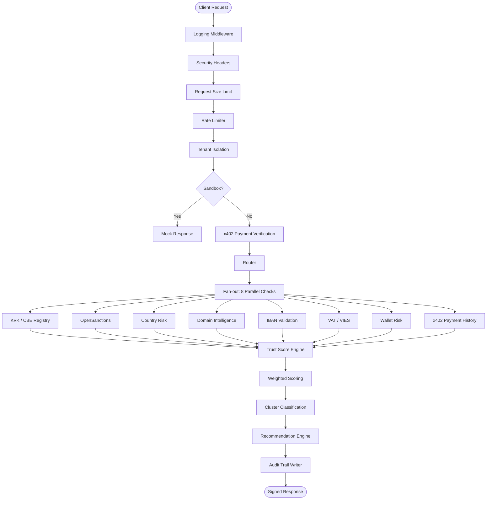
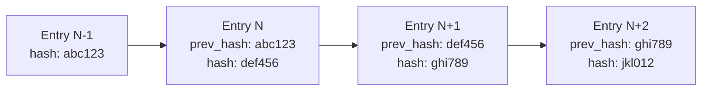

**Don't trust us. Verify us.**

That is the operating philosophy behind every architectural decision at LimitGuard. We are a trust infrastructure provider — and trust infrastructure must be independently verifiable. This document explains exactly how the system is built, what data it touches, where it lives, and how you can confirm every claim we make.

<Note>
LimitGuard is self-verifying. Our own trust score is publicly available at `GET /v1/self-verify` — we run ourselves through the same 8-source verification we run on every entity you submit.
</Note>

---

## Zero-Access Trust Model

LimitGuard is built on a zero-access principle: we minimize what we store, we make what we do store auditable, and we give you the tools to verify us independently.

<CardGroup cols={3}>
  <Card title="No PII Retention" icon="user-slash">
    Entity data is used only for the verification window. No personal identifiers are stored beyond what is needed to produce the trust score.
  </Card>
  <Card title="EU Data Residency" icon="shield-halved">
    All processing and storage occurs on European infrastructure. Belgian legal entity (DYNIQ BV). GDPR-compliant by design, not by retrofit.
  </Card>
  <Card title="Self-Verifying" icon="circle-check">
    LimitGuard verifies itself with its own API. Our score is public. If we don't meet our own trust bar, you'll see it.
  </Card>
</CardGroup>

<CardGroup cols={3}>
  <Card title="Hash Chain Audit Trail" icon="link">
    Every verification event is recorded in a tamper-evident hash chain. No entry can be modified without breaking the chain.
  </Card>
  <Card title="On-Chain Certificates" icon="certificate">
    Trust certificates are anchored on-chain via ERC-8004. Immutable, publicly queryable, no intermediary required.
  </Card>
  <Card title="Security Transparency" icon="eye">
    Responsible disclosure via RFC 9116. Our `/.well-known/security.txt` is public. Encrypted communications via Proton Mail.
  </Card>
</CardGroup>

---

## Data Flow

A single `POST /v1/entity/check` request moves through the following stages. All 8 data sources are queried in **parallel** — not sequentially — which is why median response time is under 500ms.



<Note>
The middleware chain runs top-to-bottom on every request. Sandbox detection fires **before** payment verification — if you are in sandbox mode, x402 is never reached. See [Sandbox Mode](/sandbox) for details.
</Note>

---

## Middleware Security Stack

Every request passes through 8 middleware layers before reaching the router. Order is fixed and cannot be bypassed.

| Position | Middleware | Purpose |
|----------|-----------|---------|
| 1 | **Logging** | Structured request logging with correlation IDs |
| 2 | **Security Headers** | HSTS, CSP, X-Frame-Options, X-Content-Type-Options |
| 3 | **Request Size Limit** | Blocks oversized payloads before parsing |
| 4 | **Rate Limiter** | Per-tenant, per-IP sliding window limits |
| 5 | **Tenant Isolation** | API key validated; request scoped to tenant context |
| 6 | **Sandbox** | Detects sandbox mode; bypasses downstream if active |
| 7 | **x402 Payment** | Verifies EIP-3009 signature or checks API key tier |
| 8 | **Router** | Dispatches to endpoint handler |

```
Request → Logging → Security Headers → Request Size Limit → Rate Limit
        → Tenant Isolation → Sandbox → x402 Payment → Router
```

<Tip>
Security headers are set at the middleware layer, not the application layer. This ensures they are present on every response — including errors, health checks, and 402 responses — regardless of which handler processes the request.
</Tip>

---

## The 8 Data Sources

LimitGuard queries 8 independent data sources in parallel. No single source determines the outcome — the trust score is a weighted composite across all available signals.

<CardGroup cols={2}>
  <Card title="1. KVK / CBE Registry" icon="building">
    **Dutch Chamber of Commerce (KVK) and Belgian CBE business registry.**

    Verifies legal registration status, company age, registered address, SBI/NACE activity codes, and filing history. An active registration with multi-year history is a strong positive signal. Shell companies and recently dissolved entities are flagged.
  </Card>
  <Card title="2. OpenSanctions" icon="shield">
    **80+ global sanctions and watchlist sources.**

    Checks against OFAC (US), EU consolidated list, UN Security Council, UK OFSI, and dozens of national and regional lists. OpenSanctions is the industry-standard open-source sanctions dataset — updated daily.
  </Card>
  <Card title="3. Country Risk" icon="globe">
    **CPI (Corruption Perceptions Index) + FATF grey and blacklist.**

    Jurisdiction risk is evaluated using Transparency International's CPI score and the FATF (Financial Action Task Force) list status. High-risk jurisdictions — particularly FATF blacklisted or greylisted countries — reduce the trust score regardless of other signals.
  </Card>
  <Card title="4. Domain Intelligence" icon="link">
    **WHOIS registration age, DNS configuration, and SSL certificate analysis.**

    Domain age is a strong fraud signal: most fraudulent entities use recently registered domains. We also inspect DNS records for anomalies, check for DMARC/SPF/DKIM email authentication, and validate SSL certificate chain and expiry.
  </Card>
  <Card title="5. IBAN Validation" icon="credit-card">
    **Bank account structure and BIC/SWIFT verification.**

    Validates the structural integrity of provided IBANs, resolves the BIC, and checks the issuing institution against known risk lists. Mismatched country codes between the IBAN and the declared entity jurisdiction are flagged.
  </Card>
  <Card title="6. VAT / VIES" icon="file-invoice">
    **EU VAT number validation via the European Commission VIES system.**

    Confirms that the provided VAT number is active and registered to the declared entity name. VIES is the authoritative EU source for cross-border VAT verification — used by tax authorities across all 27 member states.
  </Card>
  <Card title="7. Wallet Risk" icon="wallet">
    **On-chain wallet screening for ETH, BTC, and SOL addresses.**

    Checks provided wallet addresses against known mixer, darknet, and sanctioned wallet lists. Transaction graph heuristics identify wallets with direct exposure to high-risk counterparties. Supports Ethereum, Bitcoin, and Solana.
  </Card>
  <Card title="8. x402 Payment History" icon="clock-rotate-left">
    **On-chain payment trust record via LimitGuard's own transaction history.**

    Entities with a verified history of x402 USDC payments receive a positive trust signal. This is a LimitGuard-native data source: entities that transact through the protocol build a verifiable on-chain trust record over time.
  </Card>
</CardGroup>

### Source Availability by Request

Not every source is queried on every request. Source selection depends on which identifiers are provided and which tier (`cached`, `fresh`, `enhanced`) is requested.

| Source | Required Field | Always Queried? |
|--------|---------------|-----------------|
| KVK Registry | `kvk_number` or NL `country` | No — NL/BE only |
| CBE Registry | `cbe_number` or BE `country` | No — NL/BE only |
| OpenSanctions | `entity_name` | Yes |
| Country Risk | `country` | Yes |
| Domain Intelligence | `domain` | When provided |
| IBAN Validation | `iban` | When provided |
| VAT / VIES | `vat_number` | When provided |
| Wallet Risk | `wallet_address` | When provided |
| x402 History | `wallet_address` | When provided |

<Note>
More identifiers = higher confidence. An entity check that includes a KVK number, domain, VAT number, and IBAN will produce a significantly more accurate score than one submitted with name and country only.
</Note>

---

## Trust Scoring Methodology

The trust score is not a black box. Every score comes with `top_factors` that explain exactly which signals drove the result, which source produced them, and how much weight they carried.

### Output Fields

```json
{
  "trust_score": 87,
  "trust_level": "high",
  "cluster": "established_eu_sme",
  "recommendation": "proceed",
  "confidence": 0.94,
  "top_factors": [
    {
      "source": "kvk",
      "signal": "Active registration, 8+ years",
      "impact": "positive",
      "weight": 0.35
    },
    {
      "source": "sanctions",
      "signal": "No match across 80+ lists",
      "impact": "positive",
      "weight": 0.25
    },
    {
      "source": "vat",
      "signal": "VIES verified EU VAT — name match",
      "impact": "positive",
      "weight": 0.20
    },
    {
      "source": "domain",
      "signal": "Domain age 6+ years, valid DMARC",
      "impact": "positive",
      "weight": 0.15
    }
  ]
}
```

### Score Bands

| Score Range | `trust_level` | `recommendation` | Typical Action |
|-------------|---------------|------------------|----------------|
| 80 – 100 | `high` | `proceed` | Automated approval |
| 60 – 79 | `medium` | `review` | Human review recommended |
| 40 – 59 | `low` | `enhanced_due_diligence` | Enhanced KYB before proceeding |
| 0 – 39 | `critical` | `block` | Do not transact |

### Entity Clusters

The `cluster` field classifies entities into behavioural archetypes based on signal patterns across all sources. Cluster assignment improves interpretability — a `trust_score` of 72 means different things for an `established_eu_sme` versus a `newly_registered_offshore`.

| Cluster | Description |
|---------|-------------|
| `established_eu_sme` | Active EU registration 3+ years, VAT verified, clean sanctions |
| `large_enterprise` | Registry-verified, high domain age, multiple positive signals |
| `newly_registered` | Registration under 12 months — not inherently suspicious, but reduced confidence |
| `unverified_jurisdiction` | Country risk flag or no registry match |
| `high_risk_indicators` | One or more active risk flags (sanctions proximity, FATF jurisdiction, mixer wallet) |
| `sanctioned_entity` | Direct sanctions match — automatic `block` recommendation |

### Confidence Score

The `confidence` field (0–1) reflects how much data was available to produce the score. An entity verified across 7 of 8 sources scores `0.96+`. An entity verified with name and country only may score `0.55`.

<Tip>
Build confidence thresholds into your integration policy. For example: require `confidence >= 0.80` before automated approval, regardless of the trust score itself.
</Tip>

---

## Infrastructure and Data Residency

### Where Your Data Lives

| Layer | Location | Provider |
|-------|----------|----------|
| API servers | EU (Contabo VPS) | Contabo GmbH — German-owned, EU-hosted |
| Database | EU | Self-hosted on EU infrastructure |
| Cache (Redis) | EU | Co-located with API servers |
| Legal entity | Belgium | DYNIQ BV |

<Note>
LimitGuard does not use AWS, GCP, or Azure. All infrastructure is self-hosted on European VPS infrastructure under a Belgian legal entity. There is no US data transfer and no reliance on hyperscaler data processing agreements.
</Note>

### GDPR Compliance

LimitGuard is GDPR-compliant by default — not through configuration.

<Steps>
  <Step title="Data minimization">
    Only the fields you submit are processed. We do not enrich requests with additional personal data beyond what is required for verification.
  </Step>
  <Step title="No PII retention">
    Entity data is used only within the verification window. Raw input fields are not stored after the trust score is produced. Hashed identifiers are retained for audit trail integrity only.
  </Step>
  <Step title="Right to erasure (Art. 17)">
    GDPR Article 17 right to erasure is supported. Submit a deletion request via `DELETE /v1/legal/erasure` with your entity hash. Audit trail entries are zeroed; the hash chain remains intact.
  </Step>
  <Step title="EU data residency">
    All processing occurs on EU infrastructure under a Belgian legal entity. No cross-border transfers to third countries outside the EEA.
  </Step>
  <Step title="Legal documents">
    Privacy policy, data processing addendum (DPA), and terms of service are available at `/v1/legal/*` and updated in real time.
  </Step>
</Steps>

---

## Audit Trail and Hash Chain Integrity

Every verification event is recorded in a tamper-evident append-only log. Each entry includes a SHA-256 hash of the previous entry — forming a hash chain that makes retroactive modification detectable.

### How the Chain Works



If any historical entry is modified, its hash changes — which breaks every subsequent entry in the chain. The break is immediately detectable by any verifier replaying the chain from the genesis entry.

### Audit Entry Structure

```json
{
  "entry_id": "audit_01JQ...",
  "timestamp": "2026-02-20T09:14:33.421Z",
  "event_type": "entity_check",
  "tenant_id": "tenant_hash_only",
  "entity_hash": "sha256:b94d27...",
  "sources_checked": ["kvk", "sanctions", "country_risk", "domain", "vat"],
  "trust_score": 87,
  "trust_level": "high",
  "prev_hash": "sha256:3e4f2a...",
  "entry_hash": "sha256:9c1b8d..."
}
```

<Note>
Audit entries contain **hashes of entity identifiers**, not the identifiers themselves. The entity name, KVK number, and other submitted fields are never stored in the audit log — only a one-way hash that allows correlation without reconstruction.
</Note>

### Querying the Audit Trail

```bash
# Retrieve audit history for a hashed entity
GET /v1/audit/{entity_hash}
X-API-Key: lg_live_xxxxxxxxxxxxxxxxxxxx
```

```json
{
  "entity_hash": "sha256:b94d27...",
  "entries": [
    {
      "timestamp": "2026-02-20T09:14:33.421Z",
      "trust_score": 87,
      "trust_level": "high",
      "chain_valid": true
    }
  ],
  "chain_integrity": "valid",
  "entry_count": 1
}
```

---

## Self-Verification

LimitGuard verifies itself using its own API. This endpoint is public, free, and unauthenticated.

```bash
curl https://api.limitguard.ai/v1/self-verify
```

```json
{
  "entity": "DYNIQ BV",
  "country": "BE",
  "trust_score": 91,
  "trust_level": "high",
  "cluster": "established_eu_sme",
  "recommendation": "proceed",
  "confidence": 0.97,
  "verified_at": "2026-02-20T06:00:00Z",
  "sources_checked": ["cbe", "sanctions", "country_risk", "domain", "vat"],
  "top_factors": [
    {
      "source": "cbe",
      "signal": "Active Belgian CBE registration",
      "impact": "positive",
      "weight": 0.35
    },
    {
      "source": "sanctions",
      "signal": "No match across 80+ lists",
      "impact": "positive",
      "weight": 0.25
    },
    {
      "source": "vat",
      "signal": "VIES verified Belgian VAT",
      "impact": "positive",
      "weight": 0.20
    }
  ]
}
```

<Tip>
We recommend integrating `/v1/self-verify` into your vendor due diligence workflow. If LimitGuard's own trust score drops below `high`, you will see it before we tell you. The endpoint is cached with a 1-hour TTL and refreshed every 6 hours.
</Tip>

---

## On-Chain Trust Certificates (ERC-8004)

Trust certificates are anchored on-chain using the ERC-8004 standard. Once issued, a certificate is immutable, publicly queryable, and independent of LimitGuard's uptime.

### How Certificates Work

<Steps>
  <Step title="Verification completed">
    A `POST /v1/entity/check` or `POST /v1/kyb/check` request is processed at `enhanced` tier.
  </Step>
  <Step title="Certificate issued">
    If the entity reaches `trust_level: high` with `confidence >= 0.90`, a certificate is issued and anchored on Base (EVM).
  </Step>
  <Step title="On-chain record">
    The certificate contains the entity hash, trust score, sources checked, issuer address, and timestamp. The entity identifier itself is never written on-chain — only the hash.
  </Step>
  <Step title="Public verification">
    Anyone can verify a certificate by querying the contract directly, or via `GET /v1/certificates/{entity_hash}`.
  </Step>
</Steps>

### Certificate Fields

| Field | Type | Description |
|-------|------|-------------|
| `entity_hash` | `bytes32` | SHA-256 of entity identifiers |
| `trust_score` | `uint8` | Score at time of issuance (0–100) |
| `issued_at` | `uint256` | Unix timestamp |
| `issuer` | `address` | LimitGuard signing address |
| `sources_bitmap` | `uint8` | Bitmask of sources verified |
| `certificate_id` | `bytes32` | Unique certificate identifier |

### Querying Certificates

```bash
# REST
GET /v1/certificates/{entity_hash}

# Direct contract query (no LimitGuard dependency)
cast call 0xCertificateContract "getCertificate(bytes32)(uint8,uint256,address)" \
  0xb94d27b9934d3e08...
```

<Note>
Certificates do not expire automatically, but they carry a `trust_score` that reflects the state at time of issuance. Consumers should check the `issued_at` timestamp and re-verify entities whose certificates are older than their risk tolerance window.
</Note>

---

## Security Transparency

### RFC 9116 Security Contact

LimitGuard publishes a machine-readable security contact per RFC 9116:

```bash
curl https://api.limitguard.ai/.well-known/security.txt
```

```
Contact: security@limitguard.ai
Contact: https://limitguard.ai/security
Encryption: https://proton.me/security
Preferred-Languages: en, nl
Policy: https://limitguard.ai/security/policy
Canonical: https://api.limitguard.ai/.well-known/security.txt
```

### Encrypted Communications

All security disclosures are handled via **Proton Mail** — end-to-end encrypted, zero-knowledge, Swiss-hosted. No disclosure is processed through standard email infrastructure.

### Responsible Disclosure

We operate a responsible disclosure programme. Security researchers who identify vulnerabilities in good faith will receive acknowledgement, coordinated disclosure timelines, and credit. See `https://limitguard.ai/security/policy` for the full programme terms.

---

## Summary: What We Claim vs. How You Verify It

| Claim | How to Verify |
|-------|--------------|
| EU-only data processing | `GET /v1/legal/dpa` — data processing addendum with infrastructure details |
| Belgian legal entity | CBE registry: search DYNIQ BV |
| No PII stored | `GET /v1/legal/privacy` — data retention policy, confirmed by Art. 17 erasure support |
| GDPR Art. 17 erasure | `DELETE /v1/legal/erasure` — functional endpoint, not just a policy |
| Hash chain integrity | `GET /v1/audit/{entity_hash}` — replay the chain yourself |
| On-chain certificates | Query the ERC-8004 contract directly — no LimitGuard dependency |
| Self-verifying | `GET /v1/self-verify` — our score, produced by our own API, public |
| Security contact | `GET /.well-known/security.txt` — RFC 9116 compliant |

<Note>
Every claim in this document is backed by a verifiable endpoint or public record. We built it this way intentionally — because a trust infrastructure provider that asks you to "just trust us" has missed the point entirely.
</Note>

---

## Further Reading

<CardGroup cols={2}>
  <Card title="Scoring Methodology" icon="chart-bar" href="https://api.limitguard.ai/v1/methodology">
    Machine-readable JSON methodology document — source weights, cluster definitions, and confidence calculation
  </Card>
  <Card title="x402 Protocol" icon="credit-card" href="/x402-protocol">
    How x402 payment verification works and how it feeds the payment history trust signal
  </Card>
  <Card title="Sandbox Mode" icon="flask" href="/sandbox">
    Test the full verification flow without touching real data sources
  </Card>
  <Card title="API Reference" icon="code" href="/api-reference/introduction">
    Full endpoint documentation including audit, certificate, and self-verify endpoints
  </Card>
</CardGroup>
